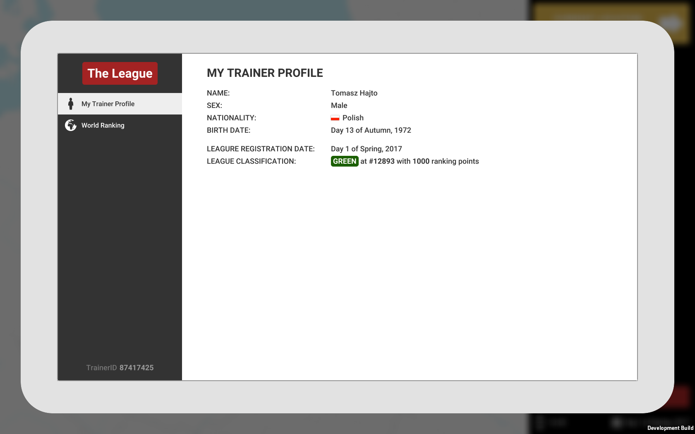
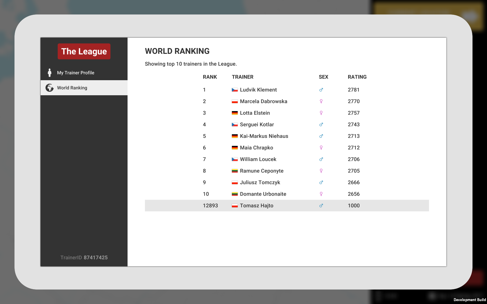
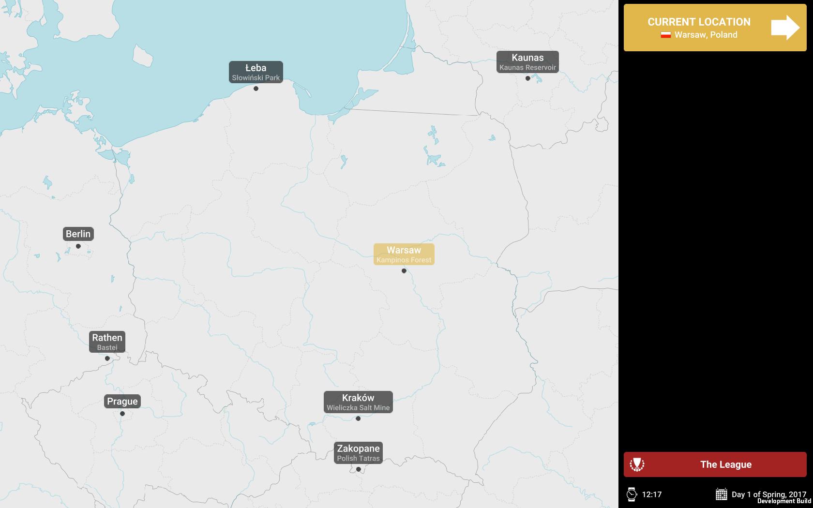
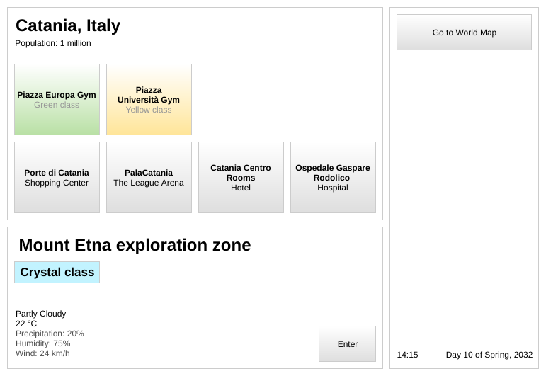
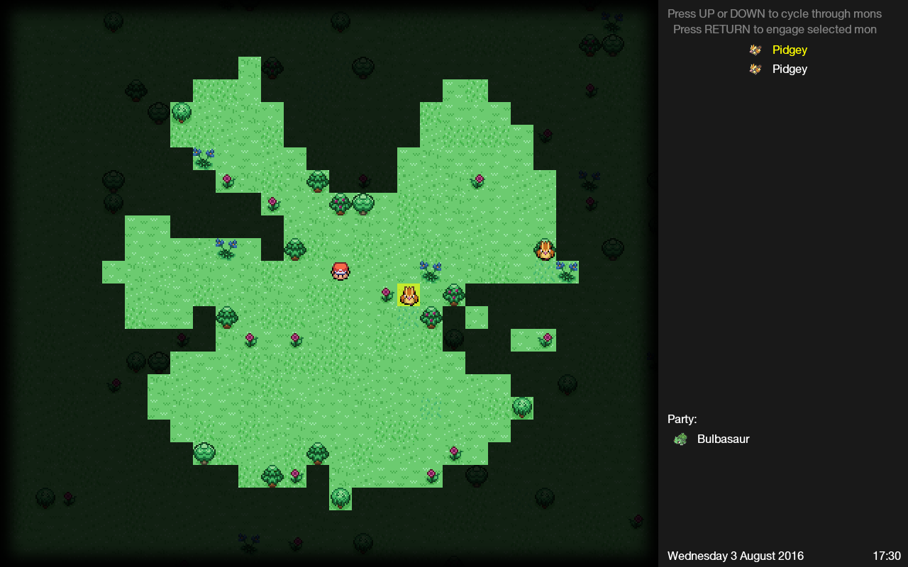
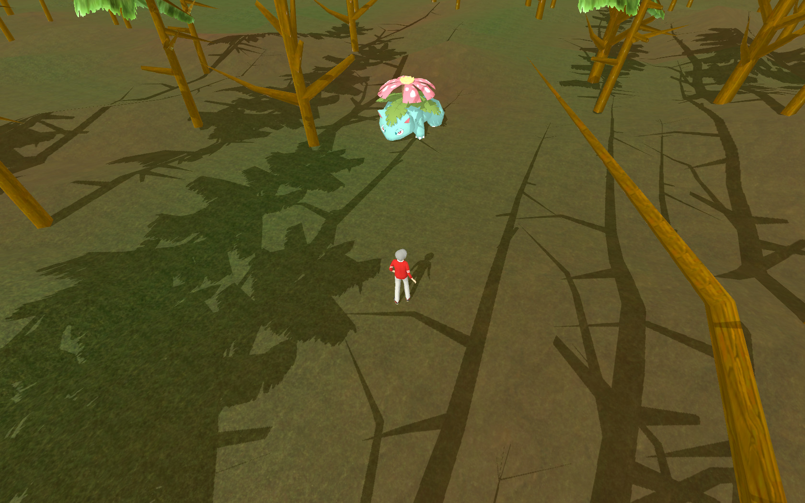
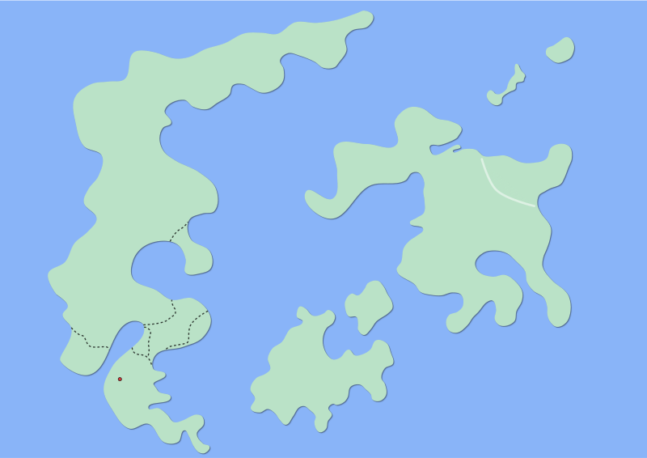

# Codename: Monmonde

Notes on an idea for an open world exploration / monster collection / monster battling game.

*[This document was initially created mid-2017. It has been substantively revised in March 2021 and again in April–May 2022.]*

## Introduction

The idea: A single-player game involving explorationG3 of a large world\* G2, catching creaturesG1 G2 G3, training themG1, and climbing the ladder of a deeply-simulatedG4 system of battlingG1 G2 competitions.

\*_The initial 2017 concept involved an alternative timeline of the real world. In the updated, simplified concept it’s a fictional world._

Inspirations:

- [G1] **Pokémon Reborn/Blue/Silver/Sapphire…** ([screenshots](https://3.bp.blogspot.com/-PB6Eh2kJoYM/WBQjXjwhJyI/AAAAAAAACeo/iHk9PZogR04Udpl0tRp_kBwygEI4pVyYgCLcB/s1600/reborn1.jpg); [video](https://www.youtube.com/watch?v=5hwjki1EsK0))
- [G2] **Pokémon Go**
- [G3] **UnReal World** ([screenshot](http://cdn.akamai.steamstatic.com/steam/apps/351700/ss_e2ef9b4c7f6a39feaed3413655eb654f2f9b590e.1920x1080.jpg); [video](https://www.youtube.com/watch?v=nwJIYNoJ-44&t=1m00s))
- [G4] **Football Manager** ([screenshot](https://www.pcinvasion.com/wp-content/uploads/2016/11/football-manager-2017-5.png); [video](https://www.youtube.com/watch?v=hIPAPjCADKI&t=5m00s))

Planned release date for the game: _December 2031_ (initial optimistic estimation; updated realistic estimation: somewhere between the time of Korean reunification and the world reaching climate neutrality).

Please feel very welcome to creatively appropriate any of the ideas below for your own projects that will never be finished.

## What concrete has been made so far

- Seven [“prototypes”](#prototypes).
- The basis for the game’s core (see [`sim/`](sim)).
- [Minor tool(s)](#utilities).

## What’s in this repository

[`battle-proto/`](battle-proto) contains the most recent prototype of the battle module (see [Battle system](#battle-system) and [Prototypes](#prototypes)). [`sim/`](sim) contains the basis for the simulation module, the game’s core.

## Table of contents

- [Introduction](#introduction)
- [What’s in this repository](#whats-in-this-repository)
- [Table of contents](#table-of-contents)
- [Game design overview](#game-design-overview)
- [Prototypes](#prototypes)
- [Utilities](#utilities)
- [Just like MAKE game](#just-like-make-game)
- [Various design notes/ideas](#various-design-notesideas)

## Game design overview

The game takes place in fictional world filled with Pokémon or creatures similar to Pokémon (hereinafter _Mons_). The player is a competitor in Mon training/battling, or a Mon Trainer. This is the dominating competitive sport of the game world and it’s organized as a centralized hierarchy of tournaments going from local affairs up to World Championship. This organization is called _The League_.

   
  <em>An example concept diagram of The League system (click to see the full image)</em>

### The League

At the heart of The League is the **World Trainer Ranking**. All registered trainers (i.e. all trainers in the world — this is a monopoly) are ranked in a global ladder using an Elo-like system. The trainers are also assigned a **trainer class** (think “Bronze” in League of Legends). Every Mon battle is recorded by The League\*, with its result affecting the competitors’ ratings.

\*_Except the underground battles, of course!_

  
   
  <em>Prototype MP-C: Trainer profile (left), World Ranking (right)</em>

See [notes on gyms, trainer classes, tournaments and more](#various-design-notesideas).

### Inter-location travel

The player can travel between **locations** by using the world map interface. Travels costs time and other resources, depending on the means chosen (e.g. bus, train, plane, Mon).

   
  <em>Prototype MP-C: The world map (Note, 2021: the current design no longer involves real-world locations.)</em>

### Locations

[Note, 2021: the current design no longer involves real-world locations.]

_Example location: “Catania / Mount Etna”_

Each location is constituted by a **settlement** (ranging from a small village to a metropolis) and an optional **exploration zone**.

   
  <em>Location screen mockup</em>

#### Settlements

_Example settlement: “Catania”._

Settlements are collections of **places of interest** the player can visit (e.g., a shop, a **gym**, a park). Everything at this level and below is visually represented as simple UI elements. For example, a gym is represented as a list of trainers present whom the player can potentially challenge, a shop is a list of items available for purchase.

#### Exploration zones

_Example exploration zone: “Mount Etna”._

These are the hosts for the exploration mechanic, and the main places the player can encounter and catch wild Mons. Their actual bodies are generated procedurally according to the zone’s climate and other characteristics. For the player, the main goal of exploring the zones is to find promising mons that fit their team and catch them.

Additional points:

- These expeditions are meant to be longer adventures lasting for (in-game) days. The deeper you go, the tougher it gets, but also the more rare Mons and items you can encounter.

- Mechanics similar to animal hunting from UnReal WorldG3 might be a good fit here.

- You will not find a huge and menacing Tentacruel in a local lake, but in an ocean — you just might. Hence every exploration zone has a class assigned by The League. Only trainers of that class and above are permitted to enter the zone.

- Visually, we will have to go for a text representation or simple 2D tile graphics.

  
   
  <em>2D tile exploration interface (prototype MP-A, left), 3D exploration interface (prototype MP-D, right — forget about it)</em>

- Inspiration: [Vanilla Bagel: The Roguelike](https://store.steampowered.com/app/491510/Vanilla_Bagel_The_Roguelike/)

### Mons

Some remarks:

- The Pokémon type system has got [quite out of hand](https://pro-rankedboost.netdna-ssl.com/wp-content/uploads/2016/11/sun-and-moon-type-chart-2.jpg) over the years. There is definitely something to be done there. See:

  - [_Rock Paper Pokemon_ (charles.uno)](http://charles.uno/rock-paper-pokemon/),

  - [_Q: What seven (types) would that be, and what would decide where an existing Pokemon would get placed?_ (pokemaniacal.tumblr.com)](http://pokemaniacal.tumblr.com/post/143978158221/what-seven-would-that-be-and-what-would-decide),

  - [EvoCreo elemental chart](http://ilmfinity.com/assets/EvoCreo_elements.png), [EvoCreo class chart](http://ilmfinity.com/assets/EvoCreo_classifications.png).

- When we consider the beloved original Pokémon designs, you cannot just make Dragonite a Normal type or even Butterfree a Grass type. This problem disappears with dedicated Mon designs.

### Battle system

I’d like to try something slightly different here. Current idea: real-time battles; your Mons have AI too — you can train them, prepare a battle plan, issue commands during the battle, but they aren’t going to execute what you want perfectly.

https://user-images.githubusercontent.com/4130634/170079118-ce4cd8dc-187c-4a58-8a5d-6ba6471305c1.mp4

- Reference: [Pokémon Reborn: Field Effects](http://pokemon-reborn.wikia.com/wiki/Field_Effects).

## Prototypes

**MMP-A** 
_Themes_: map view, 2D exploration 
_Tech_: Kotlin, libGDX 
_Source code_: https://github.com/fauu/Monmonde-initial-prototypes/tree/master/MMP-A

[**MMP-B**](https://github.com/fauu/Monmonde-initial-prototypes/tree/master/MMP-B) — 2D exploration, battle — Kotlin, libGDX, Artemis-odb

[**MMP-C**](https://github.com/fauu/Monmonde-initial-prototypes/tree/master/MMP-C) — World Map, MonGear, The League, calendar — C#, Unity Engine, Zenject, MBTiles

**MMP-D** — 3D exploration — C#, Unity Engine

[**MMP-E**](https://github.com/fauu/Monmonde-initial-prototypes/tree/master/MMP-E) — Suitability of the tech stack in question — Electron, TypeScript, React, MobX, PixiJS

[**MMP-F**](https://github.com/fauu/Monmonde-initial-prototypes/tree/master/MMP-F) — World simulation — Kotlin, libGDX

[**MMP-G**](https://github.com/fauu/Monmonde/tree/master/battle-proto) — Battle module implementation on the Web stack, its design prototype — TypeScript, React, PixiJS

## Utilities

<dl>
  <dt><a href="https://github.com/fauu/langmangler">langmangler</a></dt>
  <dd>Create words in a fictional language by transforming words from a real language. (Tech: Rust.)</dd>
</dl>

## Just like MAKE game

### 1. Decide on the tech

#### Frontend

##### Requirements

- Future-proof
- Multiplatform
- Suited for building complex UIs with short iteration times
- For Battle Mode and Exploration Mode: either good GFX support (e.g. WebGL) or the ability to be integrated into a graphical application (e.g. [Ultralight](https://github.com/ultralight-ux/Ultralight)).

##### Candidates

###### 🟊🟊

<dl>
  <dt><u>The Web platform</u> (TypeScript/…)</dt>
  <dd>Con: communication with the backend separated by a barrier (unless the backend also runs in the browser).</dd>
</dl>

###### 🟊

<dl>
  <dt><u>JavaFX</u> (Java/Kotlin)</dt>
  <dd>
– Requires more effort and is less future-proof than with the Web tooling. 
– Apparently hard to integrate with custom GFX. 
– Apparently there are problems with performance. 
– The overall API design might be a bit cumbersome by today’s standards.
  </dd>

  <dt><u>Jetpack Compose</u> (Java/Kotlin)</dt>
  <dd>Immature but has good prospects.</dd>

  <dt><u>Unity</u> (C#)</dt>
  <dd>A lot of effort needed to reimplement what the Web tooling gives us for free.</dd>

  <dt><u>Godot</u> (GDScript/C#?/native?), <u>libGDX</u> (Java/Kotlin), etc.</dt>
  <dd>Cons roughly the same as Unity.</dd>
</dl>

###### No, but maybe

<dl>
  <dt><u>HumbleUI</u> (Clojure)</dt>
  <dd>Not nearly mature enough, but promising.</dd>

  <dt><u>Slint</u> (Rust)</dt>
  <dd>Great prospects, would allow for going monolingual with a Rust backend.</dd>

  <dt><u>Avalonia</u> (C#)</dt>
  <dd>Immature. (2022: Bumped it back from “No” for now, since the last time I looked at it was a few years ago now.)</dd>
</dl>

###### No

<dl>
  <dt><u>Qt QML</u> (C++, Python)</dt> 
  <dd>Becomes overly complex if you stray from stock controls; the MOC makes having adequate bindings for sane compiled languages hard.</dd>

  <dt><u>Qt Widgets</u> (C++, Python)</dt>
  <dd>No GPU acceleration; inflexible styling; lack of bindings for preferred languages: see above.</dd>

  <dt><u>QSkinny</u> (C++)</dt>
  <dd>Immature, questionable prospects, lack of bindings.

  <dt><u>GTK</u> (D, Nim, Rust)</dt>
  <dd>Bindings could be more mature; less flexibility and slower iteration time than Web tooling.</dd>

  <dt><u>Noesis</u> (C#)</dt>
  <dd>Proprietary, much less support than the Web tooling, (probably more to uncover).</dd>
</dl>

#### Backend

##### Requirements

- Future-proof.
- Enough throughput to handle a non-trivial simulation workload.
- Fast iteration:
  - Short compilation times.
  - Good tooling.
  - Broad ecosystem.

##### Candidates

- Nim (native target)
  - Wait for: incremental compilation and improved tooling.
- Rust (native target)
  - ~~Wait for: improved compilation times.~~
    - This appears to have already been solved to an extent by the Cranelift backend and the quality of rust-analyzer.
- Java
    - Can’t see real cons and it’s only set to get better throughout the decade.
    - Should suffice performance-wise, especially considering Moores’ law and Project Valhalla (the main concern being memory usage for large numbers of simulated trainers).
- Kotlin
  - Need to see if the language server is good enough and if the compilation time penalty over Java isn't too large for it to be worth it, given Java’s progress in terms of convenience featuers.
- C#
  - From what I glanced, it seems they’re overloading the language with too many features for its own good.
  - I’ve heard very mixed things about the Linux tooling.
- JS/WASM target (JS, TS, Nim, Kotlin, Rust, …)
  - Can this handle the simulation workload properly? The problem is we don't know how demanding the simulation will get. But if we're assuming that the JVM or the CLR could handle it, then surely V8 could too, especially as time passes?
  - Would WASM actually be a significant enough of an improvement in terms of integration compared with WebSocket communication with an out-of-browser backend?
  - Currently, WASM supposedly doesn’t even have a performance advantage over JS (not that JS is especially slow).
- Zig, Jai
  - Would likely require the most effort with no relative payoff that I can think of.

#### Stacks to particularly keep in mind for the future

<u>**Ultralight** with an integrated backend</u> (TypeScript + a backend language + bgfx etc.)

- Proprietary and not fully future-proof, although the project seems to be gaining traction (March 2021).
- Frontend/backend communication is more direct than with Electron.
- Battle/Exploration gfx done with bgfx or something of the sort:
  - High performance.
  - Allows for going monolingual.
  - Tight integration with the simulation.

<u>**Jetpack Compose** with an integrated backend</u> (Java/Kotlin)

- Monolingual, very tight integration.
- Seems it needs some serious hacking to get it rendering over OpenGL gfx.

<u>**Slint** with an integrated backend</u> (Rust)

- Battle/Exploration would be done with Bevy.

<u>Kotlin/JS React + Kotlin on backend</u>

#### The tentative tech choices

The backend running the simulation and the game logic to be written in **Rust**.

The UI to be done on the Web Platform using **TypeScript** and **SolidJS**, **Svelte** or **React**.

The Battle engine to be: (1) done in **Rust**, so that it can share types with the core, (2) compiled to WASM, so that it can be embedded into the UI.

- Should it talk to the UI directly (which I am presuming will be possible by just calling into the JS) or through the backend?

  - (This doesn’t need to be answered now because of the next consideration.)

- The whole WASM/WebGL/WebGPU situation isn’t yet mature enough (March 2021), but it’s a safe bet it will be in a few years. In the meantime, the engine needs to be developed as a native program with a temporary built-in UI. Its basis should be something that abstracts from the rendering backend and that will support WASM/WebGPU in the future. Bevy is a good candidate.

### 2. Design and implement the Minimum Viable Product

- Battle Mode

  This must be very solid from the start.

- Exploration Mode

  Go with a very simple text-based mechanic for now (as in text descriptions, not as in roguelike ASCII graphics). Doing the full version of this will be very effort-consuming, and the battling and competition systems should be good enough to carry the game (mostly) on their own.

- The World
  - The MVP will be limited to a small region of the world, but the player needs to feel that the entire world to explore and conquer is alive. Design the world in very general outlines — just enough to do a very superficial simulation of its trainers and major competitions.
  - Generated procedurally:
    - Trainers
  - Defined manually:
    - The world map
    - The names and defining characteristics of locations

   
  <em>WIP world map design</em>

## Various design notes/ideas

Note: Some of those still reflect old assumptions (e.g. using the real world as the basis).

### Classes

- The class progression for trainers, exploration zones, competitions and gyms is the following: _Candidate (Green) ➡ Yellow ➡ Silver ➡ Sapphire ➡ Master_.
  - Candidate trainers are trial trainers — after a set amount of time they enter a tournament in which they either win The League lifetime trainer license or lose and need to wait a few years to apply for a candidacy again.
  - Candidate trainers aren’t ranked. Their sole task is to prepare for the tournament.
  - Estimated trainer count for each class: Candidate (Green) — one million; Yellow — 100 thousand; Silver — 10 thousand; Sapphire — one thousand; Master — one hundred;
    - Subject to change depending how the simulation will turn out in terms of performance.
    - Battles of Candidate trainers aren’t simulated. The simulation of their tournaments only goes as far as: record that such and such tournament took place, simulate the top 4 and the winner.

### Trainers

- Each registered trainer has a rank, a rating (Elo-like) and a class.

### Exploration zones

- Each exploration zone has a class.
- Trainer class determines the max. class of the exploration zones a trainer is allowed to access.

### Gyms

- Settlements have gyms.
- Every gym has a class assigned.
- A settlement has at most one gym of each class.
- If a settlement has gyms of a certain class, it neccessarily has gyms of all the lower classes.
- Def. _National prestige_ is the ranking power of the countrie’s top trainers.
- Settlements are assigned gyms according to their size and the national prestige of the country they are situated in.
- The highest gym class of a city designates its prestige.
- A trainer is allowed access to a gym only if their trainer class is equal to that of the gym.
- At a gym, trainers do training fights. Those fights affect their League ratings (with a low weight), just like every other fight.
- Def. _Intraclass rank_ is trainer’s rank in relation to that of other trainers within the same class.
- At a gym there can be trainers with low, medium or high intraclass rank.
- At a gym, there is always one of gym leaders present on-duty.
- Gym leaders are chosen amongst trainers with a high intraclass rank of the class gym’s class.
- A trainer admitted to a gym can challenge its leader to a match once a certain period.
- Defeating a gym leader yields the trainer the badge of the gym.

### Trainer class

- To advance to a higher class, the trainer has to collect 8 badges from any gyms of a given class.
- If the rating of trainer falls below a threshold level equal to that of a high intraclass rating of the class below, he gets relegated.
- After being relegated to a lower class, trainer loses the badges that allowed him to advance to the higher class in the first place and is then a subject to the standard promotion procedure described above.

### Competitions

#### World Championship

- The _World Challenger Cup_ takes place once a year.
- The World Challenger Cup has 128 participants.
- The first phase of the cup follows the [swiss-system format](https://en.wikipedia.org/wiki/Swiss-system_tournament).
- The second phrase of the cup follows the single-elimination format.
- The winner of the World Challenger Cup takes part in a _World Championship Match_ where he faces the reigning world champion.
- The winner of the World Championship Match becomes the World Champion for the following year.
- Allocation scheme for the World Challenger Cup spots:
  - 1 loser of the previous World Championship Match,
  - 6 continental champions,
  - remaining spots assigned according to the League ranking.

#### Continental and National championships

- The format of the six Continental Championships and the many National Championships is analogous to that of the World Championships.
- Allocation scheme for the _Continental Challenger Cup_ spots:
  - One loser of the previous _Continental Championship Match_,
  - X _National Champions_ of the countries situated on a given continent (perhaps with a minimal requirement for national prestige or trainer class),
  - remaining spots assigned according to the league ranking.
- Allocation scheme for the _National Challenger Cup_ spots:
  - One loser of the previous _National Championship Match_,
  - remaining spots assigned according to the league ranking.

#### Competition battles

- Different field types.
- Matches in a BO3/BO5 system with each round being played on a different type of field, chosen in a ban/pick system.

#### Stat system

##### Concepts

- `StatType`
  - `name: string`
- `StaticStat`
  - `type: StatType`
  - `level: number [1–100]`
- `Stat` extending `StaticStat`
  - `progress: number [0.0–1.0]`
    - Progress towards the next stat point
  - `modifier: number [0–2]`
    - Decreases full potential by `[0–2] * full potential`
- `Species`
  - `stats: Map<StatType, StaticStat>`
- `Mon`
  - `species: Species`
  - `stats: Map<StatType, Stat>`
- `BattleMon`
  - `mon: Mon`
- `Move`
  - `requirements: Map<StatType, Stat>`

###### `Stat` details

- Possible values: `[10, 11, …, 100]`
- Species genetic component
  - Determines base stats and full potential
  - Possible values (base): `[10, 20, 30, 40, 50]`
    - Maximum potential value is double the base value.
    - Represented as 1–5 stars.
- Individual genetic component
  - Modifies base stats and full potential
  - Decreases full potential by `[0–2] * full potential`
- Individual training component
  - Determines actual stats taking base stats as an input
  - Capped so that full potential is never surpassed

##### Other Mon characteristics

- `Fitness` (à la Football Manager; exhaustion could be combined into this perhaps)

##### Evolution

- Based on “experience”
  - For a wild mon under regular conditions this accumulates slowly
    - Ex: Wild Venusaurs might be extremely rare, although wild Butterflies will be common, as reaching that evolution requires much less experience
  - For a wild mon under challenging conditions accumulates faster
  - For a trained mon accumulates the fastest
- Can have catalysts

##### Moves

- Specialities/Stats/Types are divided into Physical and Elemental.
- Damage of offensive moves with Physical factor (“Contact” moves?) depend on Mon’s weight
- Ideas:
  - Have purely aesthetic subtypes of the different Specialities in order to have variants of moves, i.e. “Sting Attack” would be named “Horn Attack” for Horn-spiked mons and “Stinger Attack” for Stinger-spiked mons.
  - Optional requirements that make attack stronger, e.g. “Spike” StatType for Poison Sting.

##### Effective stats

- HP dependent on … and on weight.
  - Or make the yet unknown stat depend on weight…

#### Lore

- Inspiration: <https://www.reddit.com/r/AskScienceFiction/comments/d36grp/pokemon_what_is_the_common_factor_with_all/f00x8fa/>
