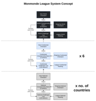
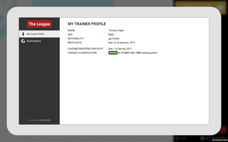
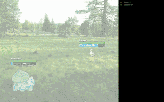

===

---

__Note:__
This is a design document that refers to initial prototypes of the game which can be found in [Monmonde-initial-prototypes repository](https://github.com/fauu/Monmonde-initial-prototypes).
Details of the current iteration will appear here eventually.

---

# Introduction

Notes on an over-ambitious game.

Inspired by **Pokémon (Reborn/Blue/Silver/Sapphire…)**[G1] ([ss](https://3.bp.blogspot.com/-PB6Eh2kJoYM/WBQjXjwhJyI/AAAAAAAACeo/iHk9PZogR04Udpl0tRp_kBwygEI4pVyYgCLcB/s1600/reborn1.jpg); [vid](https://www.youtube.com/watch?v=5hwjki1EsK0)), **Pokémon Go**[G2], **UnReal World**[G3] ([ss](http://cdn.akamai.steamstatic.com/steam/apps/351700/ss_e2ef9b4c7f6a39feaed3413655eb654f2f9b590e.1920x1080.jpg); [vid](https://www.youtube.com/watch?v=nwJIYNoJ-44&t=1m00s)) and  **Football Manager**[G4] ([ss](https://www.pcinvasion.com/wp-content/uploads/2016/11/football-manager-2017-5.png); [vid](https://www.youtube.com/watch?v=hIPAPjCADKI&t=5m00s)).

Planned release date: December 2031

Last revision: July 29, 2017

# Table of Contents

   * [Overview](#overview)
      * [The League](#the-league)
      * [Inter-location travel](#inter-location-travel)
      * [Locations](#locations)
         * [Settlements](#settlements)
         * [Exploration zones](#exploration-zones)
      * [Mons](#mons)
      * [Battle system](#battle-system)
   * [Prototypes](#prototypes)
   * [Utilities](#utilities)
   * [Random notes](#random-notes)
        * [Classes](#classes)
        * [Trainers](#trainers)
        * [Exploration zones](#exploration-zones-1)
        * [Gyms](#gyms)
        * [Trainer class](#trainer-class)
        * [Competitions](#competitions)
            * [World Championship](#world-championship)
            * [Continental and National championships](#continental-and-national-championships)
        * [Competition battles](#competition-battles)

# Overview

*TL;DR: A single-player Pokémon(-like) game[G1] with emphasis on free exploration[G3] of "real" world[G2], catching creatures[G1;G2;G3], training them[G1] and finally climbing the ladder of a simulated[G4] competitive Pokémon(-like) battling world.*

The game takes place in a world very similar to ours, yet with a tiny difference — it's filled with Pokémon[G2] (or other creatures based on Pokémon, like in the [countless](https://play.google.com/store/apps/details?id=ilmfinity.evocreo.main.android) [clone](https://play.google.com/store/apps/details?id=com.pockettrend.neomonsters) [games](https://www.youtube.com/watch?v=IANUE6nZmbk). That's beside the point, let's call them *Mons* from now on).

The player is a Mon Trainer. This is a difficult, consuming, dangerous, yet extremely rewarding profession (like in the main franchise if it were targeted at manchildren and adults, and not manchildren and children) — and thus competitive Mon battling is the most beloved competitive sport on the planet.

The player's final goal is to become world champion of *The League*, which is a multi-tiered, global system of competitions populated by all registered trainers in the world. It is **The** League.

*League system concept diagram (click to see the full image)*

## The League
At the heart of the above-mentioned competition system is the **trainer ranking**. All registered trainers (i.e. all trainers in the world) are ranked in a global ladder using an Elo-like system. The trainers are also assigned a **trainer class** (think *Supreme Master First Class* in Counter-Strike: Global Offensive or *Bronze* in League of Legends). Every mon battle is recorded by The League, with its result affecting the parttakers' ratings.

*Prototype MP-C: Trainer profile (left), World Ranking (right)*

[Notes on gyms, trainer classes, tournaments and more](#random-notes)

## Inter-location travel
The player can travel between **locations** by using the world map interface. Travels cost both **time** and **money**. The cost is dependent on the means of transportation chosen (e.g. bus, train, plane, [mon?]). Available means on transportation depend on the origin and the destination.

*Prototype MP-C: The world map*

## Locations
*Example location: "Catania / Mount Etna"*

Each location has one or two constituents: a **settlement** (ranging from a small village to a metropolis) and an optional **exploration zone**. 

*Location screen mockup*

### Settlements
*Example settlement: "Catania"*

Settlements are concentrations of **places of interest** the player can visit (e.g. a shop, a **gym**, a park). Everything at this level and below is just simple UI. For example, a gym is a list of trainers present that the player can potentially challenge, and a shop is a list of items available to purchase.

### Exploration zones
*Example exploration zone: "Mount Etna" — lots of fire-type mons there!*

These are the hosts for the exploration mechanic, but also the sole places where the player can encounter and catch wild mons.

Their actual bodies are generated procedurally (on the player's first entry into the zone) according to the zone's climate and other characteristics. These characteristics also determine what kind of mons one can find there (lots of Caterpies in a temperate forest, not so much in a desert).

For the player, the main goal of exploring the zones is to find promising and fitting mons for their team and catch them. 

Additional points:

* These hiking expeditions are meant to be quite the adventures, lasting for (in-game) days. The deeper you go, the tougher it gets, but also the more rare mons you can encounter.

* Mechanics similar to animal hunting from UnReal World[G3] might be a good fit here.

* You won't find a huge Tentacruel in a local lake, but in an ocean — you just might. Hence every exploration zone has a class assigned by The League. Only trainers of that class and above are permitted to enter the zone.

* As for the actual form of the exploration screen, there are two options: the simple, reasonable, roguelikelike-y 2D grid and the complex, unresonable, full-on 3D environment. The former is a far better choice for pragmatic reasons (although the [MapMagic World Generator](https://www.assetstore.unity3d.com/en/#!/content/56762) is quite amazing and hard to resist).

*Prototype MP-A: 2D exploration (left); Prototype MP-D: 3D exploration (right)*

## Mons
* The Pokémon type system has gotten [quite out of hand](https://pro-rankedboost.netdna-ssl.com/wp-content/uploads/2016/11/sun-and-moon-type-chart-2.jpg) over the years. There's definitely something to be done there:

  * [*Rock Paper Pokemon* (charles.uno)](http://charles.uno/rock-paper-pokemon/),

  * [*Q: What seven (types) would that be, and what would decide where an existing Pokemon would get placed?* (pokemaniacal.tumblr.com)](http://pokemaniacal.tumblr.com/post/143978158221/what-seven-would-that-be-and-what-would-decide),

  * [EvoCreo elemental chart](http://ilmfinity.com/assets/EvoCreo_elements.png), [EvoCreo class chart](http://ilmfinity.com/assets/EvoCreo_classifications.png).

* When considering the widely beloved Nintendo Pokémon designs, I doubt anyone would be happy if Dragonite were to be a Normal type or Butterfree a Grass type. This problem disappears when we're talking custom mons, as they would be able to be designed with the potential new type system in mind.

## Battle system

* I'm a huge fan of trying something non turn-based. The matter requires a lot of research and more involved prototypes.

*Prototype MP-B: battle*

* [Pokémon Reborn: Field Effects](http://pokemon-reborn.wikia.com/wiki/Field_Effects)

# Prototypes
|Name|Themes|Tech|Source code available|
|---|---|---|---|
|MP-A|old map view, 2D exploration|Kotlin, libGDX|[yes](https://github.com/fauu/Monmonde-initial-prototypes/tree/master/prototype-MP-A)|
|MP-B|2D exploration, battle|Kotlin, libGDX, Artemis-odb|[yes](https://github.com/fauu/Monmonde-initial-prototypes/tree/master/prototype-MP-B)|
|MP-C|world map, mongear, the league, calendar|C#, Unity Engine, Zenject, MBTiles|[yes](https://github.com/fauu/Monmonde-initial-prototypes/tree/master/prototype-MP-C)|
|MP-D|3D exploration|C#, Unity Engine|no|
|MP-Eureka|suitability of Electron/React/MobX/PixiJS stack|TypeScript, Electron, PixiJS, React, MobX|[yes](https://github.com/fauu/Monmonde)|

# Utilities
|Name|Description|Tech|Source code available|
|---|---|---|---|
|chessdb-name-scraper|Rips names and surnames of chess players from chess-db.com and outputs them in a format that can be used by the trainer generator of prototype MP-C|Python3, Beautiful Soup|[yes](chessdb-name-scraper)|

# Random notes

#### Classes
* The class progression for trainers, exploration zones and gym is as follows: *Green ➡ Yellow ➡ Silver ➡ Crystal ➡ Master*.

#### Trainers
* Each registered trainer has a rank, a rating (Elo-like) and a class.

#### Exploration zones
* Each exploration zone has a class.
* Trainer class determines the max. class of exploration zones the trainer is allowed to access.

#### Gyms
* Settlements have gyms.
* Every gym has a designated class.
* A settlement has at most one gym of each class.
* If a settlement has gyms of a certain class, it neccessarily has gyms of each of the lower classes.
* Def. *National prestige* is the ranking power of its top trainers.
* Settlements are assigned gyms with regard to their scale and the national prestige of the country they are situated in.
* The highest gym class of a city designates its prestige.
* A trainer is allowed to enter a gym only if their trainer class is equal to that of the gym.
* At a gym, trainers partake in training fights between eachother. Those fights affect their league ratings (with a low weight) like every other fight.
* Def. *Intraclass rank* is trainer's rank in relation to that of other trainers within the same class.
* From above points it follows, that at a gym there can be trainers with low, medium or high intraclass rank.
* At a gym, there is always one of gym leaders present on-duty.
* Gym leaders are chosen amongst trainers with a high intraclass rank of the class equivalent to that of the gym.
* A trainer admitted to a gym can challenge its leader to a match once a certain period.
* Defeating a gym leader yields the trainer the badge of the gym.

#### Trainer class
* To advance to a higher class, trainer has to collect 8 badges from any gyms of a given class.
* If the rating of trainer falls below a threshold level, equal to that of a high intraclass rating of the class below, he gets relegated.
* After being relegated to a lower class, trainer loses the badges that allowed him to advance to the higher class in the first place and is then a subject to the standard promotion procedure described above.

#### Competitions
##### World Championship
* The *World Challenger Cup* takes place once a year.
* The World Challenger Cup has 128 participants.
* The first phase of the cup follows the [swiss-system format](https://en.wikipedia.org/wiki/Swiss-system_tournament).
* The second phrase of the cup follows the single-elimination format.
* The winner of the World Challenger Cup takes part in a *World Championship Match* where he faces the reigning world champion. 
* The winner of the World Championship Match becomes the World Champion for the following year.
* Allocation scheme for the World Challenger Cup spots:
  * 1 loser of the previous World Championship Match,
  * 6 continental champions,
  * remaining spots assigned according to the league ranking.

##### Continental and National championships
* The format of the six Continental Championships and the many National Championships is analogous to that of the World Championships.
* Allocation scheme for the *Continental Challenger Cup* spots:
  * 1 loser of the previous *Continental Championship Match*,
  * X *National Champions* of the countries situated on a given continent (perhaps with a minimal requirement for nation prestige or trainer class),
  * remaining spots assigned according to the league ranking.
* Allocation scheme for the *National Challenger Cup* spots:
  * 1 loser of the previous *National Championship Match*,
  * remaining spots assigned according to the league ranking.

#### Competition battles
* Different field types.
* Matches in a BO3/BO5 system with each round being played on a different type of field, chosen in a ban/pick system.
